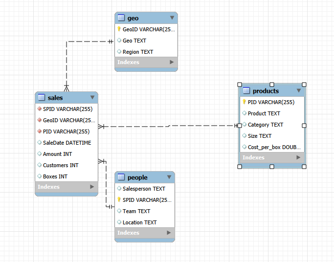

# 🍫 Awesome Chocolates Sales Analysis

## 📌 Project Overview

**Awesome Chocolates Sales Analysis** is a SQL-based data analysis project developed using **MySQL and MySQL Workbench**.

The project focuses on analyzing chocolate sales data to understand business performance across **products, categories, countries, regions, customers, and salespersons**.

The analysis was performed using multiple relational tables and SQL queries to extract meaningful business insights from the sales data.

---

## 🎯 Project Objectives

The main objectives of this project are:

1. Analyze overall sales performance.
2. Calculate total sales, customers, and boxes sold.
3. Identify top-performing products based on sales.
4. Analyze sales performance by product category and size.
5. Compare sales across countries and regions.
6. Identify top-performing salespersons.
7. Analyze high-value sales transactions.
8. Apply SQL concepts to answer business questions and generate insights.

---

## 🗃️ Database Structure

The project contains **4 relational tables**:

### 🍫 1. Sales

The `sales` table contains sales transaction information.

**Key columns:**

- `SPID` – Salesperson ID
- `GeoID` – Geography ID
- `PID` – Product ID
- `SaleDate` – Date of sale
- `Amount` – Sales amount
- `Customers` – Number of customers
- `Boxes` – Number of boxes sold

---

### 📦 2. Products

The `products` table contains product information.

**Key columns:**

- `PID` – Product ID
- `Product` – Product name
- `Category` – Product category
- `Size` – Product size
- `Cost_per_box` – Cost per box

---

### 👩‍💼 3. People

The `people` table contains salesperson information.

**Key columns:**

- `Salesperson` – Salesperson name
- `SPID` – Salesperson ID
- `Team` – Team name
- `Location` – Salesperson location

---

### 🌎 4. Geo

The `geo` table contains geographical information.

**Key columns:**

- `GeoID` – Geography ID
- `Geo` – Country
- `Region` – Region

---

## 🔗 Database Relationships

The `Sales` table acts as the central transaction table and is connected with the other tables through IDs.

### Relationships

- `Products.PID → Sales.PID`
- `People.SPID → Sales.SPID`
- `Geo.GeoID → Sales.GeoID`

These relationships allow sales data to be analyzed using product, salesperson, country, and region information.

---

## 🖼️ ER / Relationship Diagram

The following diagram shows the relationships between the tables used in this project.



---

## 🛠️ Tools & Technologies

- **MySQL**
- **MySQL Workbench**
- **SQL**

---

## 💻 SQL Concepts Used

The project demonstrates practical use of the following SQL concepts:

- `SELECT`
- `WHERE`
- `AND`
- `OR`
- `JOIN`
- `INNER JOIN`
- `SUM()`
- `AVG()`
- `COUNT()`
- Aggregate Functions
- `GROUP BY`
- `ORDER BY`
- `LIMIT`
- Filtering
- Sorting
- Primary Keys
- Foreign Keys
- Relational Database Concepts

---

## 🔍 Key Analysis Performed

### 📊 Sales Analysis

- Total company sales
- Total customers
- Total boxes sold
- Average sales amount
- Top 10 highest sales transactions

### 🍫 Product Analysis

- Total sales by product
- Top 5 products based on sales
- Highest-selling product
- Sales by product category
- Boxes sold by category
- Sales comparison by product size

### 🌎 Geographical Analysis

- Total sales by country
- Total sales by region
- Country with the highest sales
- Total customers by country

### 👩‍💼 Salesperson Analysis

- Total sales by salesperson
- Top 5 salespersons
- Total boxes sold by salesperson
- Salesperson performance analysis

---

## 🧮 Sample SQL Queries

### 1️⃣ Total Sales

```sql
SELECT SUM(amount) AS total_sales
FROM sales;
